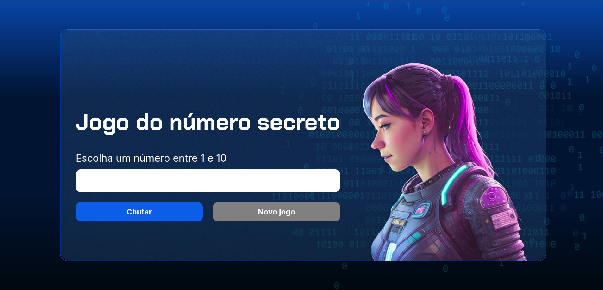

<h3 align="center">Jogo Número Secreto</h3>

	

	
[Sobre o projeto](#sobre-o-projeto) • [O jogo](#o-jogo)

## Sobre o projeto
Jogo Número Secreto é um primeiro projeto da trilha da Alura para praticar os conhecimentos obtidos sobre Git e Github

 ## Contribuidores

## O Jogo

O jogo consiste em tentar adivinhar o número secreto gerado aleatoriamente. Cada jogador possui 1 tentativa por vez e deve dar um palpite de 1 até 10.
